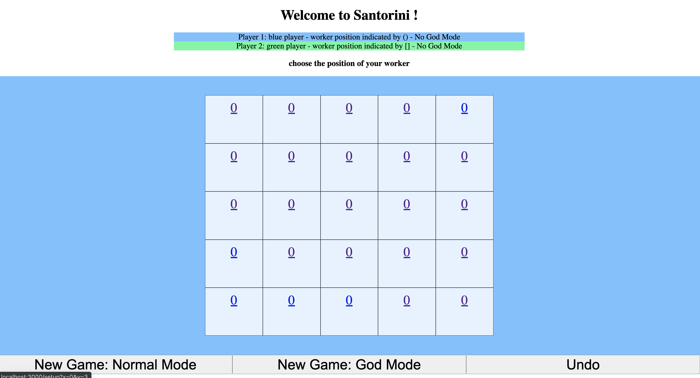

# Java Web Application Game: Santori

## Introduction

### Overview

This project is a homework project for Carnegie Mellon University's 17214/514: Principles of Software System Construction. This is a full-stack, individual project which builds a java web application implementing a board game called Santorini. More information about the game and rules can be found [here](https://roxley.com/products/santorini). The whole project took about one month to design and build. 

### Programming language and framework

This project consists of a frontend and a backend. The backend is written in Java, and the frontend is in Typescript, using the [React.js](https://reactjs.org/) framework. The frontend and backend communicates with each other using Http calls via Java [NanoHttpd library](https://github.com/NanoHttpd/nanohttpd). 

### Design patterns and overall design information

#### Design patterns

Several design patterns are utilized in the design of backend. For example:

- **Strategy pattern** that determines the specific implementation logic of the God based on the users' choice;

- **Decorator pattern** that extends the original `Game` class functionality to support both the normal mode and the extended God mode.

For information can be found on the last page (page 10) of [`justification.pdf`](justification.pdf).

### Overall design

Before coding, a [domain model](domain-model.pdf) was constructed and [peer-reviewed](peer-review.pdf). 

During implementing the code, a more detailed object model and system-sequent diagram was constructed and updated throughout the project. The finalized version can be found on page 7, 8 and 9 of the [`justification.pdf`](justification.pdf).

## Starting the game

To start the game, one needs to do the following:

### Start the backend server

- Open the folder `/backend` in the Intellj IDE, and wait for the maven to download and install the dependencies

- Go to the folder `src/main/java/app` folder and find the `App.java` file. Click on the "play" button next to the main function to run the backend.

- If succeed, the word "Running!" will appear on the terminal. 

### Start the frontend

In the terminal, under the `/frontend` folder, run the following commands:

- `npm install`: install the dependencies of the frontend

- `npm run compile` (optional): compile the scripts

- `npm run start`: start the frontend. This will create a frontend running at `localhost:3000`

### Play the game

Usually a tab will be opened automatically in the browser, if not, type `localhost:3000` in the url and the frontend will appear like below:

The numbers on the grids indicates the levels of the tower. O means nothing has been built yet. 1/2/3 would mean 1/2/3 levels has been built, and 4 would indicate a dome. 

Also, as also indicated on the UI, player 1's workers' positions would be indicated by (x), and player 2's workers' positions would be indicated by [x]. Since at the init game, no workers have been setup yet, so they are not showing up in the screenshot.

- To play the game in normal mode, just begin selecting the worker positions on the board, or click the "normal mode" to start a new game in normal mode 

- To play the game in god mode, click the "god mode" to start a new game in got mode 

- While playing, you can click the "Undo" button to undo the previous action

## Undo

The undo feature is implemented in this game. At the frontend, the user can click the "undo" button to perform the undo operation at run time. To achieve this, immutable states are used. Every call from the frontend to the backend returns a `State` object which serves two purposes: (1) telling the front end what to render, and (2) storing itself in the `History` (which is a list of `State`s internally) in the backend. When an Undo operation is called, the backend just removes the last `State` stored in the history and return the last `State` in the current `History` to the frontend. Also, the backend will also call a function `game.restore()` to restore the game environment globals to the undo state. Therefore, the frontend will be able to show the state that is just performed, and the `Undo` will be successfully implemented. 

